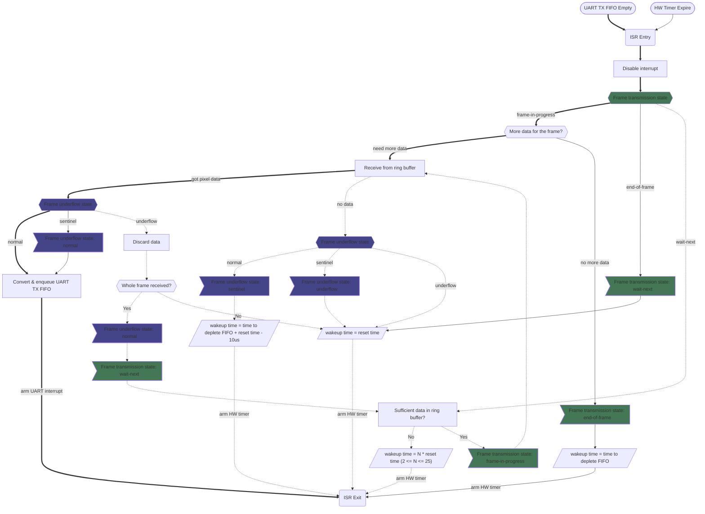

# Framebuffer-less WS2812 driver for ESP8266 RTOS
Driving WS2812 strips using UART1 TX (GPIO 02) without buffering an entire frame.

**TL;DR** for the impatient: this project allows you to drive **over 1000 pixels** of WS2812
compatible LEDs with **less than 200 bytes** buffer. [Try out the example](#how-to-use).

## The Problem
Existing addressable LED driving solutions for ESP2812 require buffering an entire "frame" in memory.
And if you think that's 3 bytes (RGB) per pixel, you are wrong -- due to how WS2812 "perceives" data,
it usually takes 12 bytes (!) to represent a pixel.

Hence a 300 pixel strip would consume 3600 bytes to buffer a frame! On top of that, to display a
smooth continuous transition, you will need at least 2 frames -- drawing on one frame while sending
the other, and that adds up to 7200 bytes of precious RAM on a tiny device with just a total 80KB of
them (realistically you only have about 50KB available, since the OS, file system and WiFi will all
consume some memory; and even less if you are also running WebServer or other services.)

## Theory of Operation
A full frame buffer is technically not really necessary, because the processor is capable of producing
pixel data faster than the LEDs can consume.

According to the WS2812 data sheet, each bit is represented as two signal levels spanning an average
of 1.25us (microseconds). Hence a 24bit RGB pixel takes 30us to transfer. ESP8266 is capable of
running at 160Mhz, which means that for every pixel transferred, the CPU could run 4800 cycles.

Let's assume 4000 instructions can be executed during that time. So as long as a pixel's data takes
less than 4000 instructions to generate, we could *theoretically* produce the pixel data on-the-fly.
*No buffering needed!* :D

### Scheduling Jitters
Of course the above analysis is very idealistic. In reality, the CPU is running multiple tasks
concurrently, so not all cycles are available for pixel data generation.

And to make matters worse, sometimes a high-priority task (such as WiFi tasks, or other interrupts)
can occupy the CPU for a prolonged period of time without releasing, thereby "starving" the pixel
generation task. Adding salt to the injury, WS2812 operates with very strict timing: a 50us quiescence
is interpreted as a "reset". So if the pixel generation task is preempted for more than 50us, the
LEDs will interpret subsequently produced pixels as "start from the beginning" -- and that is the
common cause of "flickering": pixels displayed at wrong locations.

As a result, even if each pixel only requires a few hundreds, or even less instructions to produce,
without any buffer the rendering tends to produce a lot of random defects, which is not acceptable.

So, some amount of buffering is still needed -- just not as excessive as buffering the entire frame
(when the frame is large). The amount of buffer needed can be expressed as:
`MIN(<frame size>, <scheduling jitter budget>)`, where `<scheduling jitter budget>` is the worst
preemption interval we anticipate.

For example, it is reported that on ESP8266 the worst scheduling jitter is produced by the WiFi
sub-system, with magnitudes up to 800us. Therefore, we can use a 1200us budget to comfortably absorb
scheduling jitters. And since each WS2812 pixel takes 30us to transfer, the scheduling jitter budget
translates to a buffer of 40 pixels. So, if the strip is under 40 pixels, we buffer the entire
frame; but for strips more than 40 pixels, regardless of 50, 300, or 1000 pixels, we always only
need a *40 pixel buffer*!

### RGB Pixel vs. UART "pixel"
WS2812 perceives pixel data bits as transitions between two levels over time. As a result data we
send over the UART line is more verbose than the original RGB data. However, that doesn't mean we
have to buffer the verbose representation. Because we have ample amount of processing power at our
disposal, we could trade that with memory space -- the data can be buffered in more compact RGB
format, and on-the-fly transcribed into the verbose representation when they are sent via UART.

So, to drive a 300 pixel strip, we only need 40 * 3 = 120 bytes buffer, as opposed to 3600 bytes.
That is a whooping 96.7% saving!

### Frame "Underflow" Handling
Finally, without having precise and complete knowledge of the entire platform (which is not possible
for ESP8266, as part of the system, such as WiFi, is closed source), there is always some possibility
for a scheduling jitter of surprising magnitude to disrupt the rendering. But we could minimize the
damage by handling the disruption in a correct way.

When we temporarily run out of pixels to send before finishing rendering an entire frame, WS2812 will
reset to the first pixel. Under such situation, trying to send the rest of the frame when scheduling
resumes will do more harm than good -- it will result in some pixel data displayed at a wrong location,
albeit very briefly, often enough to produce a very visible "flicker".

A much better solution is to simply "drop" the rest of the frame. Assuming the transition sequence
being rendered is *smooth*, that means the changes across two neighboring frames are rather small.
Therefore, even if we skip updating a region of pixels for a frame and resume updating them in the
next frame, it should not result in very noticeable visual defects. Basically, doing **nothing** is
better than doing **the wrong thing**.

## How to use
Refer to the `example` directory for a minimalistic demo.

*Caution: the stock ESP8266 RTOS SDK's `timer_struct.h` has an
[incorrect definition](https://github.com/dsptech/ESP8266_RTOS_SDK/tree/fix_frc1_plus_register_layout).
This library assumes this header was already patched.
You can get an already patched version of the SDK by using the `example/platform.ini` for your project.*

### API Documentation
The APIs are broken down into two parts: the driver, and the frame rendering.

#### Driver Interface
The driver API interface is pretty simple and self-explanatory. Notable common adjustment levers are:
1. `IOConfig::reset_us`: You want to set this value as close to your LED's **lower bound** as possible.
   
   You are recommended to *start* with referring to your LED's component datasheet, but do *NOT* solely
   rely on that. Instead, test it out by running it with the driver. For example:
   * Say if you have a 200 pixel strip, create a `Renderer` with **less** pixels, e.g. 100 or 50;
   * Run a 10~30 sec color transition.
   * First set the reset time to the value from the datasheet -- if it is any good, you should see your
     configured number of pixels light up as you defined.
   * Then, reduce the reset time, you can do it gradually or use some algorithms (e.g. binary search),
     and run the transition again. If you start to see *more* pixels light up than what you configured,
     that is an indication that the reset time is *too low*.
   * Keep searching until you find the smallest number that does not light up excessive pixels.

   The reason finding a good reset time is important is that it allows the driver to accurately detect
   [frame underflow](#frame-underflow-handling) in case it happens, and apply proper handling to
   minimize visual defects.

2. `DriverStart()` parameters, `task_stack` and `task_priority`:
   - Pixel data are [generated dynamically](#frame-rendering-api), and this process is driven by a
     dedicated task, whose stack space is consumed during this process. If you have a complex
     transition you may run out of the default allocated stack space. When that happens you can
     customize this parameter.
   - Although the driver (with properly configured reset time, see above) will minimize visual defects
     of a frame underflow, having too many of those will still degrade the visual experience. If a
     demanding tasks is running concurrently, you can boost the rendering task's priority to avoid
     it from being starved, and producing a more smooth transitions.

#### Frame Rendering API

First, some concepts:

* A "light show" is modeled as a sequence of **transitions**, and each transition composes of
a duration, and a desired "target state":

  `Initial State` --*(Duration 1)*--> `State 1` --*(Duration 2)*--> `State 2` --(...)--> `State X`

* A *transition* is basically a sequence of **frames** that splices between two states across time:

  `Start State`-->--*(Frame 1)*-->--*(Frame 2)*-->--(...)-->--*(Frame Y)*-->--`End State`

  - The number of frames is dependent on how fast a frame can be transmitted, as well as a
    configurable "target FPS".
  - *More importantly* there is an implicit parameter: the "progression factor", i.e. which point
    between the start and end state is the frame at -- that determines the content of the frame.

* And the content of a *frame* is just a sequence of color pixels, determined by the strip length.

  `(Pixel[0])--(Pixel[1])--(Pixel[2])--(...)--(Pixel[N])`

The rendering APIs reflect the aforementioned concepts:

1. `Renderer::Enqueue()` allows you to compose a "light show" by adding a sequence of "targets";
2. "Targets" are abstract concepts, which corresponds to the `Target` abstract class:
   - All targets *must* have a common concept of `duration`;
   - Two concrete targets are provided in the "stock" implementation:
     - `UniformColorTarget`: Displays a single color across the entire strip;
     - `DotTarget`: Displays a colored dot at a certain position on the strip.
   - You could implement additional targets that perform fancier transitions.
3. When the renderer runs the transition, it will:
   - Invoke `Target::RenderInit()` at the start of the transition, providing a `Frame` as the
     initial state;
   - Keep calling `Target::RenderFrame()`, providing the time passed since the transition started.
     The `Target` implementation should produce a new `Frame` instance for each call, based on the
     time passed and its internal duration.
   - Regardless of the timing in between a transition, the renderer will ensure the final frame
     of a target is rendered (even if the time passed exceeds the target duration). And that frame
     will be provided to the next target as the initial state of the transition.
4. "Frames" are also abstract concepts, which corresponds to the `Frame` abstract class:
   - A frame does not have to represent *each* pixel as a concrete memory allocation. Instead, they
     *must* implement `GetPixelData()` which enumerates the pixel data sequentially.
     - Each return consists of an `RGB8BPixel` and an `end_of_frame` indicator, which is set *after*
       the end of the frame is reached. In a sense, `RGB8BPixel` and `end_of_frame` are mutually
       exclusive. But for processing efficiency, they are presented as peer fields in `PixelWithStatus`.
     - The base implementation also provides a `index_` field and a `Reset()` implementation
       which allows "rewinding" a frame to re-enumerate its pixel data. This mechanism not currently
       used in the "stock" implementation; It is provisioned for implementing custom targets that can
       transition from any arbitrary initial state (frame).
    - Corresponding to the "stock" target instances, two concrete frames are implemented:
      - `UniformColorFrame`: render a uniform color across the frame;
      - `ColorDotFrame`: render a color dot on a frame;
    - For your custom fancy targets, you should implement the corresponding frames.
  - `RGB8BPixel` is an umbrella pixel format for all pixels color data with Red, Green and Blue
    component each in 8-bits. This is to account for the different ordering of the three components.
    - Current implementation does not perform dynamic conversion. Instead the color component order is
      statically defined, e.g via `using RGB8BPixel = GRB888;`. This allows color constants in source
      code stay agnostic to the LED's color component ordering. (But a rebuild is needed each time
      you change to a different ordering).
    - Dynamic color component order conversion may be implemented in the future.

### Driver Implementation Notes
For those who are curious about what's under the hood.

#### Interrupt Handling
Two hardware facilities are occupied by the driver: the UART and the FRC1 timer. They both share a
single ISR, which juggles its invocations between the two:

If you find the chart too confusing, there are 6 distinct operational workflows:
- **Frame transmission**: triggered by UART1 TX FIFO empty event. Will receive RGB pixel data from
  the ring buffer, convert that to level sequence, enqueue into TX FIFO; UART interrupt re-armed.
  **This is the main workflow, shown in the above chart with bold arrow connectors.**
- **Frame interruption**: triggered by UART1 TX FIFO empty event, when the frame has not been
  completely received but the ring buffer has no data; Will set HW timer a timeout of
  `time left to deplete the TX FIFO` + `reset time` - *10ns*. The idea is that, if there is still
  no data from the ring buffer when the timer expires, we will treat it as a real frame underflow
  and [drop the rest of the frame's data](#frame-underflow-handling).
  **This workflow is shown in the above chart with dotted arrow connectors.**
- **Frame completion**: triggered by UART1 TX FIFO empty event, when a frame has been completely
  received; Will set an internal flag to signal end-of-frame, an set HW timer a timeout of
  `time left to deplete the TX FIFO`.
- **Frame reset**: triggered by HW timer, when the "end-of-frame" flag is set. Will re-arm the
  timer with a timeout of `reset time`, and set the "wait-next" flag.
- **Frame waiting**: triggered by HW timer, when the "wait-next" flag is set. Will check if
  the ring buffer has sufficient data for the next frame. If so, *directly* enters the
  **frame transmission** workflow; otherwise, re-arm the timer with an increasing multiple of
  `reset time` (max 25 times `reset time`).
- **Frame drop**: triggered by HW timer. Try to receive the rest of the frame's pixel data from
  the ring buffer; If the complete frame has been received, sets "wait-next" flag and *directly*
  enters **frame waiting** workflow; Otherwise, regardless of how much data received, re-arm the
  timer with a timeout of `reset time`.
  **This workflow is shown in the above chart also with dotted arrow connectors.**

#### Ring buffer
It sits between the "user" task which [performs the rendering](#frame-rendering-api), i.e. pulling
new frames from the renderer and fetching pixel data for each frame, and [the ISR](#interrupt-handling).
It allows complex rendering operation to be performed with relaxed constraints (e.g. involving flash
reading, either for data or instructions), which cannot happen in an ISR.

The driver implementation supports two types of ring buffers: the IDF's `BYTEBUF` ring buffer, and a
block-based custom ring buffer. The default and recommended implementation is the custom ring buffer.

The IDF ring buffer implementation is more general, for example, it allows multiple concurrent senders.
However, the generality reduces its efficiency. OTOH, the custom ring buffer is tailored to the very
purpose of delivering pixels between a renderer task and the ISR, hence is more efficient.

At 160MHz with very light concurrent loads and generous jitter buffers (e.g. >1000us), there isn't a
very significant difference between the two implementations. However, at 80Mhz and pushing the buffer
size to the extreme, the custom ring buffer shows better performance and stability.

Here is a data point from my own experiment:
* Configuring the chip to run at 80Mhz, uses only a **9 pixel** ring buffer (~270us jitter);
* Rendering an **800 pixel** strip (the longest I have! :P), targeting 40fps (the maximum physically
  possible frame rate is around 41fps);
* Using the custom ring buffer resulted in **exactly 40fps**, with zero frame underflow and **zero**
  near-misses (aka. "frame interruption mode"), transition is visually smooth without defects;
* Using the IDF ring buffer resulted in **only about 35fps**, while also zero frame underflow, but
  the driver reports **hundreds** of near-misses per second. Very occasionally, I observed a tiny
  glitch during the transition. (Since no frame underflow reported, maybe my reset time should be
  a bit lower -- it is better to drop a frame or two than to glitch!)

#### FreeRTOS ticks and FPS
Currently the rendering task will sleep one tick when the renderer returned no frame in the middle
of a transition. This happens when a frame is completely rendered, but it is not yet time for the
next frame.

Since by default FreeRTOS ticks run at 100Hz, this sets up a "barrier" at 100fps. (Realistically the
rendering can reach about 105fps, because there are occasions the renderer can immediately provide
the next frame.) I believe it is sufficient for most general use.

However, if you do have short strips and wants to render at event high fps, you could configure
FreeRTOS to run ticks at higher frequency.
